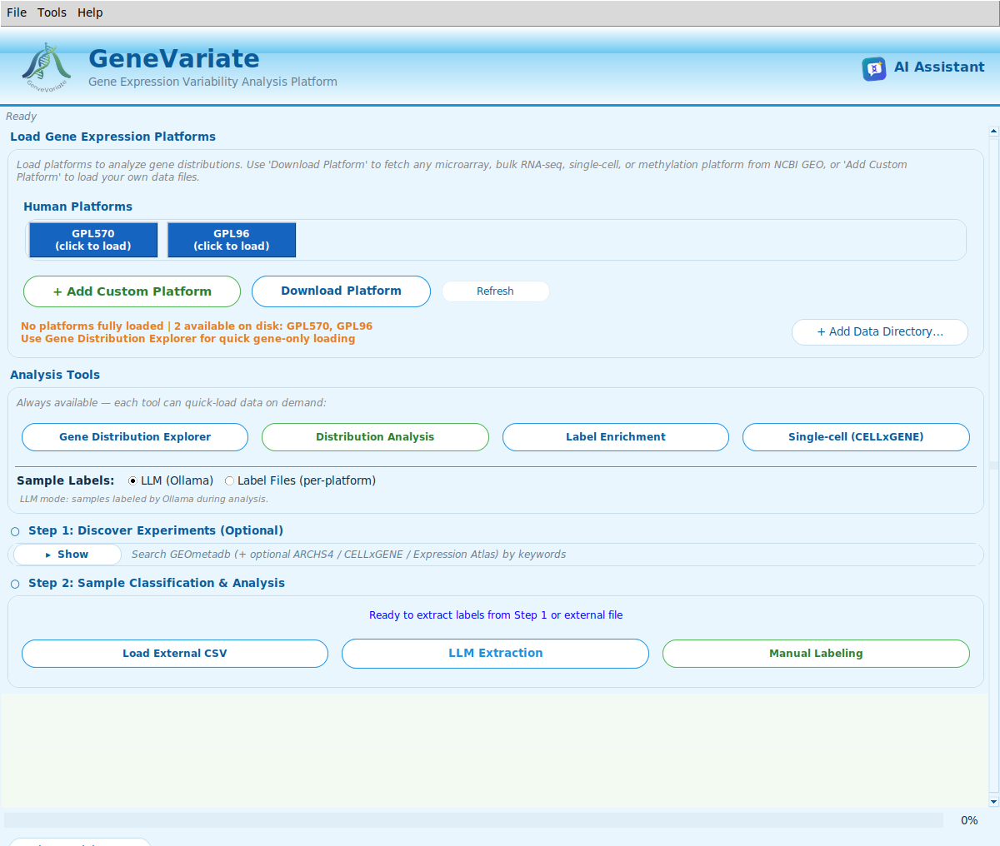
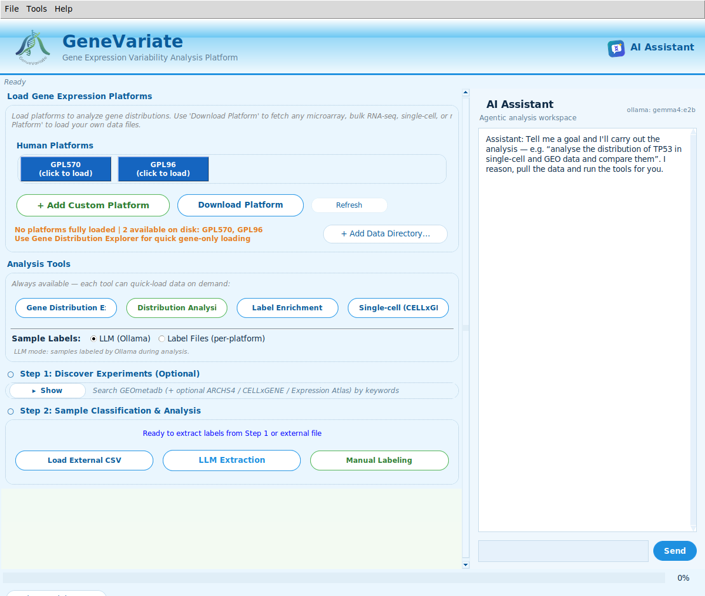

<p align="center">
  
</p>

<p align="center">
  <strong>GeneVariate</strong><br>
  <em>Variability-aware cross-technology gene-expression analysis with LLM-curated labels</em>
</p>

<p align="center">
  
</p>

<p align="center">
  <a href="#license"></a>
  
  
  
  
  
</p>

<p align="center">
  
  <br>
  <sub>The GeneVariate desktop app: load microarray / RNA-seq / single-cell platforms, run analyses, and open the AI Assistant (top-right).</sub>
</p>

---

## Table of Contents

1. [Overview](#overview)
2. [What Can You Do?](#what-can-you-do)
3. [Quick Start](#quick-start)
4. [The AI Assistant](#the-ai-assistant)
5. [Features](#features)
6. [Architecture](#architecture)
7. [Usage & Workflow](#usage--workflow)
8. [Novel Analysis Methods](#novel-analysis-methods)
9. [Development](#development)
10. [Citation](#citation)
11. [License](#license)

---

## Overview

**GeneVariate** is a local-first gene-expression analysis platform. It ingests datasets from
multiple technologies (Affymetrix / Illumina microarrays, bulk RNA-seq via
[ARCHS4](https://maayanlab.cloud/archs4/), methylation peaks, scRNA-seq pseudobulk) into a
single canonical format, then lets you ask pathway questions that standard tools cannot —
*which pathways change in variance rather than mean*, *which are driven by bimodal on/off
switches*, *which survive cross-platform meta-analysis*.

The biological metadata attached to each sample (tissue, condition, treatment) is extracted
automatically by a local LLM (`gemma4:e2b` via [Ollama](https://ollama.com/)), following the
[LLM-Label-Extractor v2.2](https://github.com/SciSpectator/LLM-Label-Extractor) prompt design
with multi-value and coded-value support.

**All inference runs on your hardware.** No API keys, no cloud, no data exfiltration.

---

## What Can You Do?

GeneVariate is both a **desktop app** (`genevariate`) and a **scriptable Python library**
(`from genevariate.core.analysis import …`). Everything below is available from the GUI, and
most of it is also exposed to the [AI Assistant](#the-ai-assistant) as a natural-language tool.

### 1 · Bring in data from any technology

| Do this | Where | Result |
|---|---|---|
| **Load a microarray platform** (GPL570, GPL96, any GPL) | *Human Platforms* buttons / **Download Platform** | Whole platform pulled from GEO, probe→gene mapped, quantile-normalised |
| **Load bulk RNA-seq** | Tools → **Load RNA-seq from ARCHS4…** | Uniformly-reprocessed GEO/SRA counts, no 30 GB local download |
| **Fetch single-cell RNA-seq** | **Single-cell (CELLxGENE)** button | Census cells filtered by tissue/disease/cell-type → pseudo-bulked → registered as a platform |
| **Load your own CSV** | **+ Add Custom Platform** / **Load External CSV** (Ctrl+O) | Your matrix ingested into the canonical `GSM | series_id | GENE…` format |

Every source lands in one canonical format, so every downstream tool consumes them identically.

### 2 · Label your samples

| Do this | Where | Result |
|---|---|---|
| **Auto-label with a local LLM** | **LLM Extraction** (Sample Labels → *LLM (Ollama)*) | Tissue / condition / treatment extracted per sample by `gemma4:e2b`, fully offline |
| **Use pre-computed labels** | Sample Labels → *Label Files (per-platform)* | Attach your own per-platform label CSVs |
| **Label by hand** | **Manual Labeling** | Interactive per-sample tagging |
| **Merge/curate labels** | Tools → **Curate Labels (LLM)** | An LLM judge reconciles labels across experiments |

### 3 · Explore & analyse

| Do this | Where |
|---|---|
| **Profile one gene's distribution** (modality, mean/CV, drag-select ranges) | **Gene Distribution Explorer** |
| **Compare distributions** across platforms/groups (KDE, PCA/UMAP, Wilcoxon, Wasserstein) | **Distribution Analysis** / Tools → **Compare Distributions** |
| **Classify every gene's modality** (unimodal / bimodal / heavy-tailed) | Tools → **Distribution Classification** |
| **Test label enrichment** (Fisher / hypergeometric) across genes, ranges, platforms | **Label Enrichment** |
| **Rank genes case-vs-control across many platforms** + meta-GSEA | Tools → **Cross-Platform Analysis** |
| **Run enrichment** (condition or ΔVariance ranking → prerank GSEA) | Tools → **Run Enrichment Analysis** |
| **Discover case/control groups automatically** from label embeddings | Tools → **Discover Pseudo-Cohorts** |
| **Infer TF / pathway activity** per sample (CollecTRI / PROGENy via decoupleR) | Tools → **Activity Inference** |
| **Browse single-cell data** (composition, UMAP, dot plots, QC) | **Single-cell (CELLxGENE)** |

### 4 · Or just ask the assistant

Press **Ctrl+/** (or the **AI Assistant** button) and type a goal in plain English — the agent
loads/fetches the data itself and runs the right tool. See [The AI Assistant](#the-ai-assistant).

---

## Quick Start

```bash
# 1. Clone
git lfs install
git clone https://github.com/SciSpectator/genevariate.git
cd genevariate

# 2. Install
python3 -m venv venv && source venv/bin/activate
pip install -e ".[analysis]"

# 3. Install Ollama and pull models
curl -fsSL https://ollama.com/install.sh | sh     # Linux/macOS
ollama pull gemma4:e2b
ollama pull nomic-embed-text

# 4. Launch
genevariate
```

Per-OS walkthroughs (including Docker, Windows, Homebrew) live in [INSTALL.md](INSTALL.md).

---

## The AI Assistant

<p align="center">
  
  <br>
  <sub>Open with the <strong>AI Assistant</strong> button or <strong>Ctrl+/</strong>. State a goal; the agent
  fetches the data and runs the tools, entirely on your machine.</sub>
</p>

Instead of clicking through menus, you can **describe what you want** and let a reasoning agent
carry it out. It decomposes the goal, **loads or downloads the data itself** (a whole GEO
platform, or CELLxGENE single-cell → pseudo-bulk), runs the appropriate analysis tool, and
narrates each step before writing a final answer. Results — table + chart + report — open in
their own window so the chat stays readable. A **Stop** button cancels between steps.

**Try prompts like:**

```text
load GPL570
analyse the distribution of TP53 on GPL570
compare BRCA1 between GPL570 and GPL96
compare TP53 across microarray and rna-seq modalities
run condition enrichment on GPL570 tumor vs normal
run meta enrichment across GPL570 and GPL96 tumor vs normal
infer TF activity on my platform
fetch single cell data for EGFR in lung
```

**Tools the assistant can call** (each drives GeneVariate's real analysis API, not a reimplementation):

| Tool | What it does |
|---|---|
| `list_platforms` | List the platforms currently loaded |
| `load_geo_platform` | Load a GEO/GPL platform — **auto-downloads the whole platform** from GEO if not on disk |
| `fetch_single_cell` | Fetch CELLxGENE single-cell → pseudo-bulk → register as a platform |
| `gene_distribution` | Profile one gene's distribution (modality + mean/median/std/CV) |
| `compare_gene` | Compare a gene across ≥2 platforms (stats + KS test) |
| `compare_modalities` | Same gene across microarray/RNA-seq/single-cell on a harmonised scale |
| `gene_connections` | Co-expression partners of a gene (Pearson/Spearman/ρ), consensus across sources |
| `classify_distributions` | Classify every gene's modality (unimodal/bimodal/heavy-tailed) |
| `rank_genes` | Top differential genes case-vs-control (no GSEA) |
| `condition_enrichment` | Rank case-vs-control → prerank GSEA |
| `variability_enrichment` | Rank by differential variability → GSEA |
| `meta_enrichment` | Cross-platform consensus (rank-product / Stouffer / random-effects) → GSEA |
| `activity_inference` | TF (CollecTRI) / pathway (PROGENy) activity per sample via decoupleR |
| `run_analysis_code` | Run a sandboxed Python snippet over the loaded platforms |
| `save_learned_tool` | Promote a working snippet into a persisted, reusable named tool |

**Runs locally by default.** The assistant uses a local `gemma4:e2b` model via Ollama (auto-installed
on first use) — no API key, no data leaves your machine. If the reasoning stack is unavailable it
falls back to deterministic keyword routing, so it works either way. Optional hosted backends
(Groq Llama-3.3-70B, or any OpenAI-compatible endpoint) are supported via `GENEVARIATE_AGENT_BACKEND`.
Full backend/tuning details are in [Features](#ai-analysis-agent--conversational-assistant).

---

## Features

### Data ingestion (cross-technology)

| Source | Technology | Notes |
|---|---|---|
| GEOmetadb | Microarray catalogue | Any GPL; queried from disk on low-RAM devices |
| ARCHS4 | Bulk RNA-seq | Uniformly-processed GEO/SRA counts via `archs4py` |
| GEO Series (GPL) | Microarray matrices | Auto probe-to-gene mapping + quantile normalization |
| scRNA-seq pseudobulk | Single-cell → bulk | Via the canonical loader |
| Methylation / peaks | β-values / intensities | Normalised through the same base class |

All sources emit the canonical format `GSM | series_id | GENE1 | GENE2 | …`, so every
downstream tool consumes them identically.

### LLM label extraction

- Unified `gemma4:e2b` model, 32k-token context, **unlimited output tokens** (`num_predict=-1`)
- Multi-phase pipeline: raw extraction → deterministic collapse → ReAct collapse agent
- Multi-value support (`"Whole Blood; Bone Marrow"`) and coded-value disambiguation (`0/1`, `Y/N`)
- 4-tier persistent memory (cluster map, semantic RAG, episodic log, knowledge graph)

### Novel enrichment methods

- **ΔVariance GSEA** — rank genes by log-variance z-test instead of mean shift
- **Bimodality-gated GSEA** — restrict testing to genes flagged bimodal/heavy-tailed
- **Cross-platform meta-enrichment** — rank-product or Stouffer combination across GPLs
- **Embedding-clustered pseudo-cohorts** — auto-discover case/control groups from LLM labels

See [Novel Analysis Methods](#novel-analysis-methods) for the statistical detail.

### Cross-modality gene analysis (`core/analysis/cross_modality.py`)

The same gene measured by microarray (log2 intensity), bulk RNA-seq (log-CPM), and
single-cell pseudo-bulk lives on three different scales, so naive cross-source tests are
meaningless. This module makes the comparison honest and adds gene–gene connection finding:

- **Same gene across modalities** (`compare_gene_across_modalities`) — harmonise each source
  to a common scale (`zscore` or `rank`), then a KS test on the harmonised values asks whether
  the gene's distribution *shape* is consistent across modalities, and the modality of each
  source is auto-labelled (`infer_modality`).
- **Connections between genes** (`gene_coexpression`) — Pearson/Spearman co-expression of a
  query gene against every other gene within one source (positive and inverse partners).
- **Reproducible connections** (`coexpression_consensus`) — keep only the partners whose link
  to the query gene holds, with a consistent sign, across two or more sources/modalities, so
  co-expression edges are reproducible rather than platform artefacts.
- Exposed to the assistant as the `compare_modalities` and `gene_connections` tools (e.g.
  *“compare TP53 across microarray and rna-seq modalities”*, *“find co-expression partners of
  EGFR consistent across platforms”*).

### AI analysis agent + conversational assistant

- Collapsible chat sidebar — open it from the **AI Assistant** button in the top-right corner
  of the header, the **Ctrl+/** shortcut, or Tools → *Assistant*. It is **one unified window**:
  state a *goal* such as *“analyse the distribution of TP53 in single-cell and GEO data and
  compare them”* and a full **LangChain** reasoning agent decomposes it, **loads/fetches the
  data itself** (GEO platforms — **auto-downloaded from GEO when not already on disk** — or
  CELLxGENE single-cell → pseudo-bulk), runs the analysis tools, and narrates its reasoning +
  each tool result live before writing a final answer. A **Stop** button cancels between steps.
  When the reasoning stack isn't available it falls back to deterministic keyword routing, so
  the assistant works either way.
- **Results open in their own window:** the chat transcript stays short (a one-line summary per
  step); the full **result table + embedded chart + markdown report** pops up in a separate,
  scrollable results window (re-openable with *Open results window*) so the small chatbox never
  gets crowded.
- **Charts + chart understanding:** every visual tool draws its plot (distribution histogram,
  cross-source overlay, enrichment/ranking bar) into the results window, and — because the local
  model is text-only — each chart ships with a **data-grounded descriptor** (shape, center,
  spread, outliers, direction, top terms) that the assistant reads to *interpret* the graph in
  words. It understands the chart from the numbers behind it, not from pixels, so it stays fully
  local with no vision model.
- **Pluggable LLM backend** (`GENEVARIATE_AGENT_BACKEND`): because the agent drives
  GeneVariate's *Python API* (not the screen), a reliable tool-caller matters more than size —
  no vision model needed.
  - `ollama` (**default**) — a fully **local** model (default `gemma4:e2b`; `qwen2.5:14b`+
    for deeper reasoning), private + offline, **no API key**, **auto-installed and
    auto-pulled** on first use. gemma4 emits native Ollama tool-calls and drives the full
    ReAct agent locally; a deterministic keyword-router fallback catches any flaky turn.
  - `groq` — Groq's free hosted **Llama-3.3-70B**, the fastest/strongest tool-caller. Paste
    a free key once in-app (console.groq.com/keys); it's saved thereafter.
  - anything else — an OpenAI-compatible endpoint (OpenRouter / Gemini / Cerebras / NVIDIA NIM)
    via `GENEVARIATE_AGENT_BASE_URL` + `GENEVARIATE_AGENT_API_KEY`.
- **Zero manual setup:** the first time you use Agent mode the app auto-installs the LLM stack
  (and, for local, installs/starts Ollama and pulls the model), streaming progress in the
  sidebar (Stop cancels). Override the model with `GENEVARIATE_AGENT_MODEL`. If a hosted key is
  declined it drops to the local model; if that's unavailable it falls back to a deterministic
  heuristic planner, then keyword routing — the app works either way. The offline planner
  chains data loading with the real analyses (condition/variability/meta enrichment, ranking,
  modality) so agentic goals still run end-to-end without any LLM.
- **Optimized local inference (quantization):** the local model runs as a **quantized GGUF**
  through Ollama/llama.cpp so a 7B fits ~8 GB VRAM at roughly double the fp16 throughput.
  Pick the GGUF level with `GENEVARIATE_AGENT_QUANT` (`q4_K_M` default → `q5_K_M` → `q8_0`;
  AWQ/GPTQ tags also work if your Ollama build serves them). The model is held resident
  between turns (`GENEVARIATE_AGENT_KEEP_ALIVE`, default `30m`) so you pay the load cost once,
  and `GENEVARIATE_AGENT_NUM_CTX` / `GENEVARIATE_AGENT_NUM_PREDICT` tune context/output length.
  Groq is a hosted LPU service and is already optimally served, so no client-side tuning applies.
- Tools (each calls the existing analysis API rather than reimplementing it, and returns a
  markdown **description + analysis** shown in the separate results window):
  `list_platforms`, `load_geo_platform` (**auto-downloads the platform from GEO** if it isn't
  on disk, bounded by `max_gse`), `fetch_single_cell`, `gene_distribution`,
  `compare_gene`, `compare_modalities` (same gene across microarray/RNA-seq/single-cell,
  harmonised), `gene_connections` (co-expression links within a source or consensus across
  modalities), `classify_distributions` (modality landscape), `condition_enrichment`,
  `variability_enrichment`, `meta_enrichment` (cross-platform consensus: rank-product /
  Stouffer / random-effects + GSEA), `activity_inference` (TF/pathway activity via decoupleR),
  `run_analysis_code` (sandboxed Python over the loaded platforms), `rank_genes`.
- **Robust to Llama tool-call quirks:** Llama-3.x occasionally emits a tool call in its
  *native text* form (`<function=name>{…}</function>`) inside the message content instead of
  through the structured tool-calls API. `run_agent` detects and executes that leaked call so
  the reasoning loop still produces a real result.
- Tk-free core in `core/chatbot/` (`build_registry`, `route`, `run_agent`, `agent_available`).
- Optional extra (pre-provision; otherwise auto-installed on first use):
  `pip install genevariate[agent]` (`langchain` + `langchain-groq` + `langchain-ollama`).

### Infrastructure

- Resource-aware worker scaling (1–210 threads) driven by live CPU/RAM/VRAM/thermal metrics
- GPU auto-detection (NVIDIA / AMD) with automatic CPU fallback
- Lazy, pay-for-what-you-use imports: `core/analysis` loads each submodule (and its heavy
  optional deps) only on first access via PEP 562 `__getattr__`, so heavy optional deps like
  `decoupler` and the batch-integration stack are pulled into memory only when that analysis
  is actually run — importing the analysis package no longer drags the GPU/tensor stack in at
  startup (base import ≈4× faster, no CUDA init for light paths)
- Low-RAM mode: GEOmetadb queried directly from disk (WAL + indexes + mmap), no OOM
- Docker image with bundled Ollama and automatic model pulling

---

## Architecture

<p align="center">
  
</p>

**Three-layer design:**

1. **Ingestion** (`core/sources/`, `core/db_loader.py`, `core/gpl_downloader.py`) — pulls
   data from GEO, ARCHS4, or local files into the canonical sample × gene matrix.
2. **Label curation** (`core/extraction.py`, `core/gse_worker.py`, `core/gse_context.py`,
   `core/memory_agent.py`, `core/ns_repair_pipeline.py`) — LLM extraction + 4-tier memory.
3. **Analysis** (`core/analysis/`, `core/statistics.py`, `core/ai_engine.py`, `gui/`) —
   variability, enrichment, distribution classification, interactive exploration.

### Module map

| Module | Purpose |
|---|---|
| `core/sources/base.py` | Canonical-format contract + shared CSV writer |
| `core/sources/archs4.py` | ARCHS4 bulk RNA-seq ingestion |
| `core/chatbot/` | Tk-free assistant: tool registry, router, LangChain reasoning agent + heuristic planner |
| `core/db_loader.py` | Shared GEOmetadb loader (decompress once, tier-adapted cache) |
| `core/gpl_downloader.py` | GPL annotation download, probe-to-gene, quantile normalization |
| `core/extraction.py` | LLM prompts, parsers, Phase 1.5 deterministic rules |
| `core/gse_worker.py` | Autonomous per-GSE extraction agent |
| `core/gse_context.py` | MemGPT-style rolling per-experiment context |
| `core/memory_agent.py` | 4-tier persistent memory (SQLite, WAL) |
| `core/ns_repair_pipeline.py` | Multi-phase NS repair orchestrator |
| `core/ollama_manager.py` | Watchdog, thermal guard, GPU detection, Ollama lifecycle |
| `core/analysis/variability.py` | ΔVariance ranking + GSEA prerank |
| `core/analysis/enrichment.py` | Mean-based Enrichr / GSEA wrappers |
| `core/analysis/meta_enrichment.py` | Rank-product / Stouffer cross-platform combination |
| `core/analysis/bimodality.py` | Distribution-gated gene filtering |
| `core/analysis/pseudo_cohorts.py` | Embedding-clustered auto-cohorts |
| `core/analysis/overdispersion.py` | Beta-binomial ρ, design effect, effective sample size, bootstrap-by-study |
| `core/analysis/synergy.py` | Multiplicative null + k-way log-linear interaction for conjunction boxes |
| `core/analysis/box_model.py` | Cross-fitted, isotonic-calibrated P(label \| genes); box integration + relaxation attribution |
| `core/ai_engine.py` | 8-class distribution classifier, outliers, transform recommender |
| `core/statistics.py` | Wilcoxon, Welch t, Wasserstein, Cohen's d, Cliff's delta |
| `gui/theme.py` | Shared Frutiger Aero palette every window draws from |
| `gui/app.py` | Main 3-step workflow application |
| `gui/region_analysis.py` | Region window: distributions, enrichment, synergy, box model, samples |

Full file tree is in [INSTALL.md](INSTALL.md#project-layout).

---

## Usage & Workflow

### GUI — the guided workflow

The main window walks you through three stages (see [What Can You Do?](#what-can-you-do) for the
full capability map):

1. **Load platforms** — click a preset platform (GPL570, GPL96), **Download Platform** to pull any
   GPL from GEO, **Load RNA-seq from ARCHS4…**, fetch **Single-cell (CELLxGENE)**, or **+ Add Custom
   Platform** for your own CSV. *(Optional)* expand **Step 1: Discover Experiments** to search
   GEOmetadb / ARCHS4 / CELLxGENE / Expression Atlas by keyword and batch-download matches.
2. **Classify samples** — under **Step 2**, choose your label source (**LLM (Ollama)** for automatic
   extraction, **Label Files** for your own, or **Manual Labeling**) and run **LLM Extraction** to
   watch the multi-phase pipeline label every sample in real time.
3. **Analyse** — use the **Analysis Tools** row (Gene Distribution Explorer, Distribution Analysis,
   Label Enrichment, Single-cell) or the **Tools** menu (Cross-Platform Analysis, Enrichment,
   Pseudo-Cohorts, Activity Inference). Or press **Ctrl+/** and ask the [AI Assistant](#the-ai-assistant).

The interface is a soft Frutiger-Aero theme: buttons, LabelFrame cards,
entry/combobox fields and notebook tabs are all rendered as anti-aliased
rounded capsules (PIL 9-slice ttk image elements), degrading to the plain
square styles if imaging is unavailable.

### Headless / CLI

```bash
genevariate --ns-repair                     # batch label extraction
genevariate-bench --help                    # reproducible benchmark harness
```

### Programmatic — novel enrichment

```python
from genevariate.core.analysis import (
    rank_genes_by_variability, run_variability_gsea,
    rank_genes_by_condition, run_prerank_gsea,
    classify_distributions, filter_ranked_by_distribution,
    combine_ranks, run_meta_enrichment_gsea,
    embedding_pseudo_cohorts,
)

# ΔVariance enrichment
ranked = rank_genes_by_variability(df, labels, "case", "ctrl", method="logvar_z")
gsea   = run_variability_gsea(ranked, gene_sets=["KEGG_2021_Human"])

# Bimodality-gated enrichment
tags   = classify_distributions(df)
gated  = filter_ranked_by_distribution(ranked, tags, keep=("Bimodal", "Multimodal"))
gsea   = run_prerank_gsea(gated, gene_sets=["KEGG_2021_Human"])

# Cross-platform meta-enrichment
per_plat = {"GPL570": r570, "GPL96": r96, "GPL13534": rmeth}
combined = combine_ranks(per_plat, method="stouffer")
meta     = run_meta_enrichment_gsea(combined, gene_sets=["KEGG_2021_Human"])
```

---

## Novel Analysis Methods

### ΔVariance GSEA (`logvar_z`)

Classical GSEA ranks genes by a mean-shift statistic. GeneVariate's default ΔVariance
ranker uses the formally directional **log-variance z-test**:

```
z = (log s²_case − log s²_ctrl) / sqrt( 2/(n_c−1) + 2/(n_k−1) )
```

For each gene, `log(s²) ~ N(log σ², 2/(n−1))` asymptotically (Bartlett 1937; Cochran 1941).
Unlike signed Levene / KS, this is natively **directional and two-sided**, making it a
legitimate GSEA prerank. Auxiliary methods (`levene`, `bf`, `ks`, `wasserstein`,
`logvar_ratio`) are retained behind opt-in flags for sensitivity analysis.

### Bimodality-gated enrichment

The `BioAI_Engine` distribution classifier tags each gene as Normal / Lognormal / Bimodal /
Multimodal / Heavy-tailed / Uniform / Skewed / Mixed. `filter_ranked_by_distribution`
restricts the gene universe before enrichment, answering:

> *Which pathways are driven by stochastic on/off switches rather than graded mean shifts?*

The analysis-layer classifier (`core/analysis/bimodality.py`) evaluates its KDE on a padded
grid so the outer modes of a mixture — which sit at the data extremes — are detected reliably
even for tight, well-separated clusters (previously such genes could be mislabelled *Uniform*).
Before the KDE heuristic it applies a formal **Hartigan dip test** of unimodality
(`diptest`, α = 0.05); when unimodality is rejected the mode count is set by a **Gaussian-mixture
BIC** search (`sklearn`), so Bimodal/Multimodal calls rest on a hypothesis test rather than
peak-counting. Both are optional — absent the packages the classifier falls back to the KDE path.

### Cross-platform meta-enrichment

Combines per-platform rankings **before** running enrichment so pathway calls survive
GPL batch effects. Two combiners:

- **rank-product** — geometric mean of per-platform ranks (Breitling 2004); non-parametric
- **Stouffer** — weighted-z combination of signed t-statistics; preserves direction
- **random-effects** — DerSimonian–Laird pooling of per-platform effect sizes (recovering each
  study's standard error as `|logFC / t|`), reporting a pooled effect, z/p, BH-adjusted q, and
  the between-study heterogeneity (`tau²`, `I²`, Cochran's `Q`). Genes seen on fewer than two
  platforms are dropped, so the meta-estimate is only formed where replication exists.

### Embedding-clustered pseudo-cohorts

Uses `nomic-embed-text` (same backbone as `MemoryAgent`) to vectorise LLM-curated condition
labels and cluster samples via KMeans — no manual case/control assignment needed. Falls
back to TF-IDF char n-grams when Ollama is unavailable.

### Multiple-testing correction & effect sizes

Every per-gene test now reports a **Benjamini–Hochberg** adjusted q-value alongside the raw
p-value. `benjamini_hochberg` (`core/analysis/enrichment.py`) is a NaN-safe, monotone-enforced
step-up procedure; `rank_genes_by_condition` emits a `padj` column so results are ranked and
thresholded on FDR rather than nominal p, and the random-effects meta-combiner reuses the same
routine. Effect sizes (log-fold-change / pooled effect) are carried through unchanged so calls
are judged on both significance *and* magnitude.

### Study-aware evidence: ρ, design effect and effective sample size

Samples from GEO are not independent draws. A label that looks like a strong finding across 700
samples may live in four studies, and counting those 700 as 700 is how a batch artefact becomes a
result. `core/analysis/overdispersion.py` estimates the **beta-binomial intra-cluster correlation
ρ** across studies by moments, converts it into **Kish's design effect** `1 + (m̄ − 1)ρ`, and
reports an **effective sample size** `n_eff = n / deff` beside the raw count. Confidence intervals
on fold change are a percentile bootstrap that resamples **studies, not samples**, so the interval
widens honestly when the evidence is concentrated. `enrichment_diagnostics` returns
`{n_gse, rho, mean_cluster, n_eff_sel, ci_low, ci_high}` per label value, and the enrichment tab
surfaces `n_GSE` and `n_eff` as columns rather than burying them.

### Multi-gene conjunction synergy

Brushing several genes at once asks whether the combination does more than the genes do separately.
`core/analysis/synergy.py` compares the observed lift inside a conjunction box against the
**multiplicative null** — the product of each gene's marginal lift — and reports the **k-way
log-linear interaction odds ratio** over the 2^k gene-combination cells, with a Haldane–Anscombe
correction and a study-bootstrapped CI. The statistic is signed: an OR above 1 is genuine synergy,
below 1 is mutual exclusion. When any cell is empty the interaction is **not identified**, so
`synergy` comes back NaN and `empty_cells` says why, rather than returning a confident number from
a degenerate table. Surfaced as the **Gene Synergy** tab.

### Calibrated box model — reading a box that holds nothing

Counting stops working before the question does: five genes brushed at their top quintile select
0.2⁵ ≈ 0.03% of a platform, so a box that should hold hundreds of samples holds none.
`core/analysis/box_model.py` fits `P(label | expression)` over the whole platform with gradient
boosting, **cross-fitted by study** (`GroupKFold` on GSE, never on samples), then wraps it in a
**cross-fitted isotonic calibration** layer so "0.3" means "happens 30% of the time" — with the
Brier score, expected calibration error and reliability curve reported so the claim is checkable.
The box is then read two ways: `p_support` over the real samples in it, and `p_uniform` by Monte
Carlo integration over its volume, which stays defined when the box is empty. `n_support` is always
returned next to it so extrapolation is labelled as extrapolation. Attribution is by **relaxation**
— each gene's bound is widened back to the data range in turn and the drop in integrated
probability is that constraint's contribution — which is exact rather than an approximation, and
answers the question actually being asked: which gene is holding this box up. Surfaced as the
**Box Model** tab. Requires `scikit-learn`.

### Compositional-bias-robust co-expression (proportionality ρ)

Correlation on relative (compositional) abundance data is biased. `gene_coexpression` /
`gene_connections` add a `rho` method computing **Lovell's proportionality**
`ρ = 1 − var(a−b) / (var(a) + var(b))` on log-expression, a compositionally coherent alternative
to Pearson/Spearman that is robust to library-size/normalisation artefacts (pure numpy, NaN-safe
per column).

### Activity inference (TF & pathway)

`core/analysis/activity.py` infers **transcription-factor** and **pathway** activity per sample
from an expression matrix via [decoupleR](https://github.com/saezlab/decoupler)'s univariate
linear model (ULM), using **CollecTRI** (TF→target regulons) and **PROGENy** (pathway response
signatures). The API is version-safe across decoupler 1.x (`dc.run_ulm`, `dc.get_collectri`) and
2.x (`dc.mt.ulm`, `dc.op.collectri`). Exposed to the assistant as the `activity_inference` tool;
`tf_activity` / `pathway_activity` / `run_activity` are the headless entry points. Optional dep —
a clear message points to `decoupler` when absent.

### Cross-platform batch integration

`core/analysis/integration.py` harmonises multiple platforms onto their shared genes
(`common_gene_matrix` → matrix + batch vector) and removes batch effects with **ComBat**
(`combat_correct`, trying `inmoose.pycombat` / `pycombat` / `combat.pycombat` backends) or a
**Harmony** embedding (`harmony_embed` via `harmonypy` + PCA). `compare_gene_across_modalities`
can pre-apply ComBat (`method="combat"`) so cross-source distribution tests run on
batch-corrected values.

### Per-run reproducibility manifest

`core/reproducibility.py` captures four pillars for any analysis: **parameters**, **package
versions** (numpy/pandas/scipy/gseapy/…), the **random seed**, and a content-sensitive
**SHA-256 hash** of every input DataFrame/array. `build_manifest` returns a JSON-able record
(with environment + timestamp) and `manifest_to_markdown` renders it for the report window; the
assistant's condition/meta tools attach a manifest so a result can be re-derived exactly.

### Sandboxed analysis code execution

The `run_analysis_code` assistant tool lets the agent run a short Python snippet against the
loaded platforms in a restricted sandbox (`core/chatbot/code_exec.py`): the source is AST-validated
(no imports, no dunder access, denylisted names rejected), executed with a curated namespace
(`pd`, `np`, a copy of the platforms, and the analysis helpers) and restricted builtins under a
daemon-thread timeout. It returns captured stdout plus a `result` table, enabling ad-hoc analysis
without exposing the host.

---

## Development

### Running tests

```bash
pip install -e ".[dev,analysis]"
pytest
```

The suite covers every `core/analysis/` module and the cross-technology source loaders
(`tests/test_variability.py`, `test_enrichment.py`, `test_meta_enrichment.py`,
`test_bimodality.py`, `test_pseudo_cohorts.py`, `test_sources.py`, `test_overdispersion.py`,
`test_synergy.py`, `test_box_model.py`).

### End-to-end validation on planted ground truth

Unit tests check that a function returns a number. They do not check that the app, driven the way a
user drives it, recovers an answer that was decided before the analysis ran. `tools/` carries a
harness that does:

```bash
python3 tools/make_synthetic_platform.py     # writes a platform + labels + GROUND_TRUTH.md
python3 tools/validate_synthetic.py          # 24 PASS/FAIL claims against what was planted
```

The generator plants a specific set of structures — an AND gate (`Liver` = two genes high
together), a single-gene marker (`Brain`, and `Sex` from XIST), a label confined to four studies
and driven by *no* gene at all, a gene that means nothing, and a label column that is pure noise —
then `GROUND_TRUTH.md` states what each tab must report. The validator checks the honesty layer
discounts the four-study label (`n_eff` ≪ `n`), that BH-FDR kills the noise column, that synergy
separates a real conjunction from a decoy pairing, that calibration does not get worse, and that
relaxation attribution charges the meaningless gene nothing. The same two CSVs load in the GUI, so
the numbers on screen can be read against the same document.

### System requirements

| Resource | Minimum (low-RAM mode) | Recommended |
|---|---|---|
| CPU | 2 cores | 8+ cores |
| RAM | 4 GB | 16+ GB |
| Disk | 3 GB | 10+ GB |
| GPU | Not required | NVIDIA 6+ GB VRAM |
| OS | Linux / macOS / Windows 10+ | Ubuntu 22.04+ / macOS 13+ |
| Python | 3.10+ | 3.11+ |

At startup GeneVariate auto-detects your tier:

| Tier | RAM | GEOmetadb | Max workers | Batch size |
|---|---|---|---|---|
| Low | ≤ 6 GB | Disk (WAL + mmap) | 4 | 50 |
| Medium | 6–14 GB | Disk or RAM | 20 | 100 |
| High | ≥ 14 GB | Full in-memory | 210 | 200 |

### Contributing

Open an issue or pull request on GitHub. Tests must pass; new analysis methods should land
in `core/analysis/` with a matching test module.

---

## Citation

```bibtex
@software{genevariate2026,
  title   = {GeneVariate: Variability-aware Cross-technology Gene-expression Analysis
             with LLM-curated Labels},
  author  = {Szczepaniak, Mateusz},
  year    = {2026},
  url     = {https://github.com/SciSpectator/genevariate},
  note    = {Paper in preparation}
}
```

---

## License

MIT — see [LICENSE](LICENSE).

<p align="center">
  <sub>Built with Ollama + gemma4:e2b · Runs entirely on your hardware · No data leaves your machine</sub>
</p>
