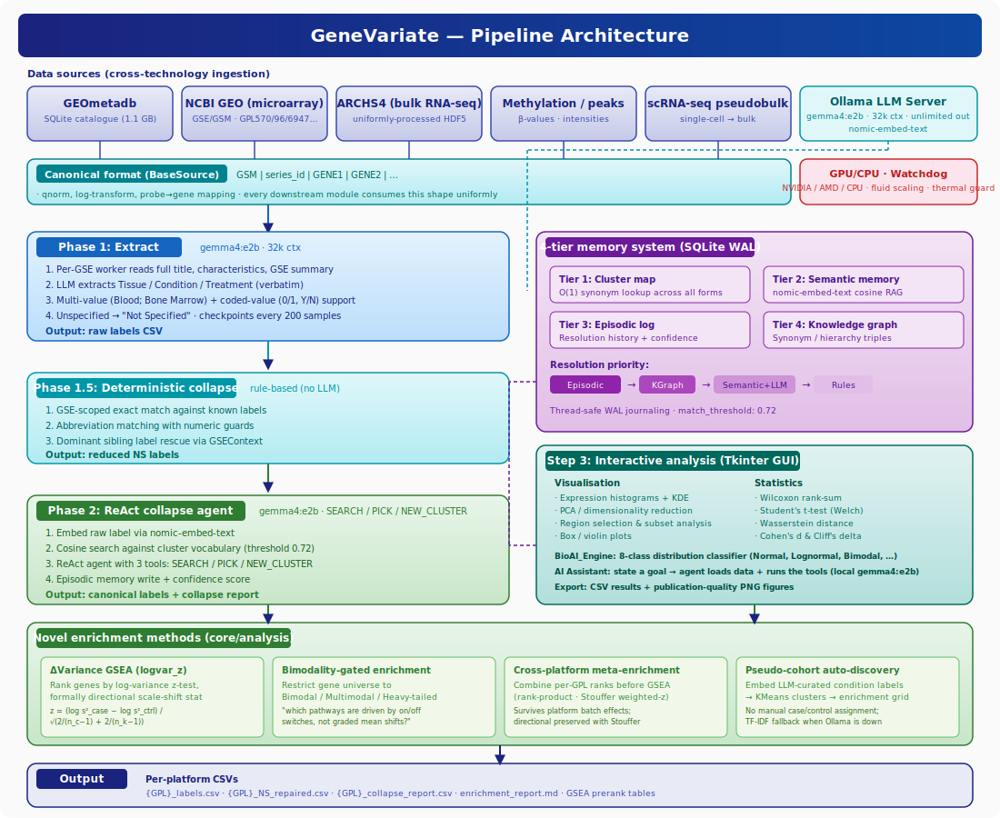

<p align="center">
  
  <br><br>
  
  <br><br>
  <strong>GeneVariate</strong><br>
  <em>Gene Expression Variability Analysis Platform with AI-powered biological metadata extraction</em>
</p>

<p align="center">
  <a href="#-license"></a>
  
  
  
  
  
  
  
  
  
</p>

---

## :clipboard: Overview

**GeneVariate** analyzes gene expression data from the [NCBI GEO](https://www.ncbi.nlm.nih.gov/geo/) database, using local LLMs (via [Ollama](https://ollama.com/)) to automatically extract and classify biological metadata such as tissue type, condition, and treatment from experiment descriptions. It features a **3-step interactive workflow** (search, extract, analyze), a **multi-phase NS repair pipeline** with agentic AI, and a **4-tier persistent memory system** for reproducible biomedical label resolution.

All inference runs locally on your hardware -- no API keys, no cloud, no data leaves your machine.

---

## :hammer_and_wrench: Features

| | Feature | Description |
|---|---|---|
| :brain: | **4-Tier Memory System** | Cluster map (O(1) lookup), semantic embeddings (cosine RAG), episodic log, knowledge graph -- all SQLite-backed with WAL journaling |
| :robot: | **Multi-Phase AI Pipeline** | Phase 1 (raw), 1.5 (deterministic collapse), 1c (full-metadata re-extraction), 2 (ReAct collapse agent) — all powered by `gemma4:e2b` with 32k context and **unlimited output tokens** |
| :bar_chart: | **Distribution Analysis** | Classify gene expression into 8 distribution types: normal, lognormal, bimodal, heavy-tailed, uniform, skewed, mixed |
| :microscope: | **Statistical Comparisons** | Wilcoxon rank-sum, Student's t-test (Welch), Wasserstein distance, Cohen's d, Cliff's delta |
| :desktop_computer: | **Interactive GUI** | Full Tkinter interface with PCA, histograms, region analysis, group comparison, and live resource monitoring |
| :dna: | **GEO Database Integration** | Query GPL570, GPL96, GPL6947, GPL10558, and any discoverable platform from GEOmetadb |
| :zap: | **Fluid Agent Scaling** | Resource-aware worker scaling (1--210) based on real-time CPU, RAM, VRAM, and thermal monitoring -- works on 4 GB laptops to 64 GB workstations |
| :gear: | **GPU/CPU Auto-Detection** | NVIDIA (nvidia-smi), AMD (rocm-smi), automatic CPU fallback -- adapts to any hardware |
| :floppy_disk: | **Low-RAM Mode** | On weak devices, GEOmetadb is queried from disk (WAL + indexes + mmap) instead of loading into RAM -- no OOM crashes |
| :whale: | **Docker Support** | One-command deployment with bundled Ollama server and automatic model pulling |
| :lock: | **Fully Local** | All inference runs on your hardware via Ollama -- zero data exfiltration |

---

## :building_construction: Architecture

<p align="center">
  
</p>

### Core Modules (`src/genevariate/core/`)

| Module | Description |
|--------|-------------|
| **`ai_engine.py`** | `BioAI_Engine` -- classifies gene expression distributions into 8 categories. Detects outliers via Z-score and IQR. Recommends data transformations (log, sqrt, Box-Cox, Yeo-Johnson). |
| **`extraction.py`** | LLM prompt templates for raw extraction and NS inference. JSON/text parsers, Phase 1.5 deterministic collapse rules, and candidate ranking by semantic specificity. |
| **`gse_worker.py`** | `GSEWorker` -- autonomous per-GSE agent. 5-step pipeline: raw LLM extraction, GSE context rescue, ReAct collapse (SEARCH/PICK/NEW_CLUSTER), Phase 1.5 fallback, episodic memory write. GPU/CPU routing with OOM fallback. |
| **`gse_context.py`** | `GSEContext` -- MemGPT-style rolling memory per experiment. Tracks title, summary, design, and live label counts updated as each sample is resolved. |
| **`memory_agent.py`** | `MemoryAgent` -- persistent 4-tier memory backed by SQLite. Tier 1: cluster map (O(1)). Tier 2: semantic embeddings (cosine RAG). Tier 3: episodic log. Tier 4: knowledge graph. Thread-safe with WAL. |
| **`ns_repair_pipeline.py`** | Main orchestrator: platform loading, GEOmetadb queries, NCBI scraping, GSEContext building, hybrid GPU/CPU dispatch, live CSV flushing, checkpoint/resume, summary reporting. |
| **`ollama_manager.py`** | `Watchdog` -- fluid worker scaling, thermal protection (88C CPU / 85C GPU hard-pause), sleep inhibitor, GPU detection (NVIDIA + AMD), Ollama lifecycle management. |
| **`statistics.py`** | `BioStats` -- Wilcoxon rank-sum, Student's t-test (Welch), Wasserstein distance, Cohen's d, Cliff's delta. Multiple testing correction. |
| **`nlp.py`** | Rule-based sample classification from metadata text fields (title, source, characteristics). |
| **`gpl_downloader.py`** | `GPLDownloader` -- downloads GPL platform annotations, probe-to-gene mapping, expression matrix assembly, quantile normalization, automatic platform discovery. |

### GUI Modules (`src/genevariate/gui/`)

| Module | Description |
|--------|-------------|
| **`app.py`** | `GeoWorkflowGUI` -- main application (16,000+ lines). 3-step workflow: GSE search, AI label extraction, interactive analysis with GPU detection and multi-phase progress tracking. |
| **`ns_repair_app.py`** | NS Repair control panel with platform selection, worker config, and real-time log/progress display. |
| **`compare_analysis.py`** | Side-by-side group comparison with statistical test results and interactive visualization. |
| **`region_analysis.py`** | Region selection on histograms with multi-region color coding and statistical comparison. |
| **`evaluation.py`** | Extraction accuracy evaluation: AI vs ground truth with confusion matrices and per-field metrics. |
| **`deterministic_extraction.py`** | Phase 1.5 review interface for rule-based label collapse before LLM Phase 2. |
| **`label_reextraction.py`** | Re-run AI extraction on specific samples or subsets with potentially incorrect labels. |
| **`standalone_extraction.py`** | Standalone extraction for independent CSV processing. |

### Utilities & Windows

| Module | Description |
|--------|-------------|
| **`utils/workers.py`** | Background threads: `ExtractionThread`, `LabelingThread`, `SampleClassificationAgent`. |
| **`utils/plotting.py`** | `Plotter` -- histograms with KDE, PCA scatter, box/violin plots, region-highlighted distributions. |
| **`windows/dialogs.py`** | Gene selection, threshold config, export options, filter dialogs. |
| **`windows/compare_dist.py`** | Distribution overlay with statistical annotations. |
| **`windows/interactive_subset.py`** | Drag-to-select subset analyzer on PCA/histogram plots. |

---

## :robot: Agent Workflow

The pipeline uses **autonomous GSEWorker agents** where each GEO experiment is handled by an independent worker. Here is the step-by-step workflow:

1. **Platform Discovery** -- Query `GEOmetadb.sqlite` to find all GPL platforms matching species and technology filters.

2. **GSE Queue Build** -- For each platform, all associated GSE experiments and their GSM samples are queued for processing.

3. **Phase 1: Extract** -- Worker agents spawned in parallel (4--210 concurrent). Each agent:
   - Reads full GSM sample title, characteristics, and description (**no truncation**)
   - Reads full parent GSE experiment summary + overall design for context
   - Sends structured prompt to `gemma4:e2b` via Ollama with `num_ctx=32768` and `num_predict=-1` (unlimited output)
   - Extracts verbatim **Tissue**, **Condition**, and **Treatment** labels
   - Marks insufficient information as `Not Specified`
   - Checkpoints every 200 samples

4. **Phase 1.5: Deterministic Collapse** -- For labels still `Not Specified`:
   - GSE-scoped exact match against known labels
   - Abbreviation matching with numeric guards
   - Dominant sibling label rescue via GSEContext

5. **Phase 2: ReAct Collapse Agent** -- Remaining NS labels processed by `gemma4:e2b` with the full 32k context:
   - Check episodic memory for cached resolution
   - Embed label via nomic-embed-text, cosine search against cluster vocabulary
   - ReAct agent with 3 tools: SEARCH, PICK, NEW_CLUSTER
   - Episodic memory write with confidence score
   - Checkpoints every 1,000 samples

6. **Output** -- Per-platform CSV files with repaired labels, full annotations, and collapse reports.

---

## :computer: System Requirements

| Resource | Minimum (low-RAM mode) | Recommended |
|---|---|---|
| **CPU** | 2 cores | 8+ cores |
| **RAM** | 4 GB | 16+ GB |
| **Disk** | 3 GB (code + models + GEOmetadb) | 10+ GB |
| **GPU** | Not required (CPU-only works) | NVIDIA 6+ GB VRAM |
| **OS** | Linux, macOS, or Windows 10+ | Ubuntu 22.04+ / macOS 13+ |
| **Python** | 3.9+ | 3.11+ |
| **Ollama** | Latest stable | Latest stable |

> **Note:** GeneVariate is designed to work on "garbage local devices". On low-RAM machines (4-6 GB), GEOmetadb is queried directly from disk instead of loaded into memory, worker counts are capped, and batch sizes are reduced automatically. GPU is optional -- CPU-only mode is fully functional, just slower.

### Resource Tiers (auto-detected at startup)

| Tier | RAM | GEOmetadb Mode | Max Workers | Batch Size |
|---|---|---|---|---|
| **Low** | <= 6 GB | Disk (WAL + indexes + mmap) | 4 | 50 |
| **Medium** | 6-14 GB | Disk (< 10 GB) or RAM (>= 10 GB) | 20 | 100 |
| **High** | >= 14 GB | RAM (full in-memory) | 210 | 200 |

---

## :gear: Installation

There are **three ways** to install GeneVariate. Pick the one that matches your platform:

| Method | Platform | Best for | Requires terminal |
|---|---|---|---|
| **A. Pre-built installer** | Windows, macOS | End users — double-click to install | No |
| **B. Source + `install.py`** | Windows, macOS, Linux | Users who want the latest code | Once, then desktop shortcut |
| **C. Docker** | All | Servers / headless / reproducible builds | Yes |

> **Prerequisites common to all methods:** [Ollama](https://ollama.com) (local LLM runtime — installed separately, see per-OS sections below) and the GEOmetadb SQLite database (downloaded via Git LFS or direct URL — see [Downloading GEOmetadb](#downloading-geometadb)).

---

### :window: Windows

**Option 1 — Pre-built installer (recommended for end users)**

1. Go to the [**Releases page**](https://github.com/SciSpectator/genevariate/releases/latest)
2. Download `GeneVariate-Setup-x.y.z.exe`
3. Double-click → Windows SmartScreen → **More info** → **Run anyway** (the installer is unsigned on purpose; source is public)
4. The setup wizard walks you through:
   - **License agreement** (MIT)
   - **Install location** (default: `C:\Program Files\GeneVariate`)
   - **Start Menu folder**
   - **Desktop shortcut** checkbox
5. Click **Install** → **Finish** → GeneVariate icon appears on your Desktop
6. Install [Ollama for Windows](https://ollama.com/download/windows) and pull the models (see [step below](#install-ollama-models))

**Option 2 — From source**

```powershell
# 1. Install Python 3.11 from python.org (tick "Add to PATH")
# 2. Install Git LFS: https://git-lfs.com
# 3. Clone the repo
git lfs install
git clone https://github.com/SciSpectator/genevariate.git
cd genevariate

# 4. Install the package + create Desktop shortcut with icon
python install.py

# 5. Install Ollama
winget install Ollama.Ollama
#   OR download: https://ollama.com/download/windows
```

**Option 3 — Build the installer yourself**

```powershell
build_windows.bat
```
This runs PyInstaller → produces `dist\GeneVariate\GeneVariate.exe` with the app icon embedded. Use [Inno Setup](https://jrsoftware.org/isinfo.php) to turn it into a full `Setup.exe` wizard.

---

### :apple: macOS

**Option 1 — Pre-built `.dmg` (recommended for end users)**

1. Go to the [**Releases page**](https://github.com/SciSpectator/genevariate/releases/latest)
2. Download `GeneVariate-x.y.z.dmg`
3. Double-click the `.dmg` → drag **GeneVariate.app** to the **Applications** folder
4. Launch from **Launchpad** or **Applications** (first launch: right-click → Open to bypass Gatekeeper, since the app is unsigned)
5. Install Ollama: `brew install ollama` and run `ollama serve &`, then pull the models (see [step below](#install-ollama-models))

**Option 2 — From source**

```bash
# 1. Install Homebrew if you do not have it
/bin/bash -c "$(curl -fsSL https://raw.githubusercontent.com/Homebrew/install/HEAD/install.sh)"

# 2. Install Python + Tk + Git LFS + Ollama
brew install python-tk@3.11 git-lfs ollama

# 3. Start Ollama
ollama serve &

# 4. Clone the repo
git lfs install
git clone https://github.com/SciSpectator/genevariate.git
cd genevariate

# 5. Install GeneVariate + create Desktop launcher with icon
python3 install.py
```

**Option 3 — Build your own `.app` + `.dmg`**

```bash
./build_mac.sh
```
This runs PyInstaller → produces `dist/GeneVariate.app` with `icon.icns` embedded. To package into a `.dmg` for distribution, install [`create-dmg`](https://github.com/create-dmg/create-dmg) (`brew install create-dmg`) and run:
```bash
create-dmg --volname "GeneVariate" --window-size 540 380 \
  --icon-size 128 --app-drop-link 380 180 \
  GeneVariate-1.0.0.dmg dist/GeneVariate.app
```

---

### :penguin: Linux

Linux users install from source — no installer wizard needed.

**Ubuntu / Debian**

```bash
# 1. System dependencies
sudo apt update && sudo apt install -y python3 python3-venv python3-pip python3-tk git-lfs

# 2. Install Ollama
curl -fsSL https://ollama.com/install.sh | sh

# 3. Clone + install
git lfs install
git clone https://github.com/SciSpectator/genevariate.git
cd genevariate
python3 -m venv venv && source venv/bin/activate
python3 install.py         # creates ~/.local/share/applications/genevariate.desktop + Desktop shortcut
```

**Fedora / RHEL**

```bash
sudo dnf install -y python3 python3-pip python3-tkinter git-lfs
curl -fsSL https://ollama.com/install.sh | sh
git lfs install
git clone https://github.com/SciSpectator/genevariate.git
cd genevariate
python3 -m venv venv && source venv/bin/activate
python3 install.py
```

**Arch / Manjaro**

```bash
sudo pacman -S python python-pip tk git-lfs
# Install ollama from AUR or official
curl -fsSL https://ollama.com/install.sh | sh
git lfs install
git clone https://github.com/SciSpectator/genevariate.git
cd genevariate
python3 -m venv venv && source venv/bin/activate
python3 install.py
```

**Build a standalone binary (optional)**

```bash
./build_linux.sh
```
Produces `dist/GeneVariate/GeneVariate` (115 MB single-directory binary) + `GeneVariate.desktop` launcher. Run directly or register with:
```bash
cp dist/GeneVariate/GeneVariate.desktop ~/.local/share/applications/
```

---

### Install Ollama Models

After installing Ollama on **any** platform, pull the models GeneVariate needs:

```bash
ollama pull gemma4:e2b        # Primary extraction + collapse model (~2 GB)
ollama pull nomic-embed-text  # Semantic embeddings (~274 MB)
```

> **Note:** GeneVariate uses `gemma4:e2b` as a single unified model with a **32k-token context window** and **unlimited output tokens** — one small model handles both extraction and collapse reasoning.

---

### Launch

After installation, GeneVariate launches like any other desktop app:

| Platform | Launch method |
|---|---|
| **Windows** | Start Menu → GeneVariate, or Desktop shortcut |
| **macOS** | Launchpad → GeneVariate, or Applications folder |
| **Linux** | Activities → GeneVariate, Desktop shortcut, or `genevariate` in terminal |

Headless mode (for servers / CI):
```bash
genevariate --ns-repair
```

---

## :rocket: Quick Start

```bash
# One-line setup (after cloning)
pip install -e . && ollama pull gemma4:e2b && ollama pull nomic-embed-text

# Launch the GUI
genevariate
```

**3-Step Workflow:**

1. **Step 1: GSE Extraction** -- Select a GPL microarray platform and search GEO for experiments matching your query
2. **Step 2: Label Extraction** -- AI-powered multi-phase extraction pipeline automatically labels all samples
3. **Step 3: Analysis** -- Interactive exploration with histograms, PCA, region selection, group comparison, and statistical tests

---

## :open_file_folder: Downloading GEOmetadb

GEOmetadb is the SQLite database containing metadata for all experiments in NCBI GEO. GeneVariate needs it to search for and retrieve experiment information.

### Option A: Automatic (Git LFS)

If you cloned the repo with `git lfs install` before `git clone`, GEOmetadb is already at:
```
src/genevariate/data/GEOmetadb.sqlite.gz
```

If Git LFS was not installed during clone, pull it now:
```bash
git lfs install
git lfs pull
```

### Option B: Manual Download

Download directly from the GEO mirror:

```bash
# Linux / macOS
wget -O src/genevariate/data/GEOmetadb.sqlite.gz \
  https://gbnci.cancer.gov/geo/GEOmetadb.sqlite.gz

# Or with curl
curl -L -o src/genevariate/data/GEOmetadb.sqlite.gz \
  https://gbnci.cancer.gov/geo/GEOmetadb.sqlite.gz
```

On Windows (PowerShell):
```powershell
Invoke-WebRequest -Uri "https://gbnci.cancer.gov/geo/GEOmetadb.sqlite.gz" `
  -OutFile "src\genevariate\data\GEOmetadb.sqlite.gz"
```

### Option C: From R (Bioconductor)

If you already use R/Bioconductor:
```r
library(GEOmetadb)
getSQLiteFile(destdir = "src/genevariate/data/")
# Rename: GEOmetadb.sqlite -> gzip it or place as-is
```

### Updating GEOmetadb

GEOmetadb is updated periodically by NCI. To get the latest experiments:
```bash
wget -O src/genevariate/data/GEOmetadb.sqlite.gz \
  https://gbnci.cancer.gov/geo/GEOmetadb.sqlite.gz
```

> **Size:** ~1.1 GB compressed, ~7 GB decompressed. On low-RAM devices (<= 6 GB), GeneVariate queries it directly from disk without loading into memory.

---

## :desktop_computer: GUI Walkthrough

### Step 1: GSE Search & Selection
Select a GPL platform, enter search keywords, and browse matching GEO experiments with titles, sample counts, and metadata.

### Step 2: AI Label Extraction
Watch the multi-phase extraction pipeline in real-time:
- **Phase 1** -- Raw LLM extraction with progress bar
- **Phase 1.5** -- Deterministic collapse (rule-based, instant)
- **Phase 2** -- ReAct collapse agent with live memory status

### Step 3: Interactive Analysis
- **Expression Histograms** -- KDE overlay, distribution classification
- **PCA Plots** -- Dimensionality reduction with group coloring
- **Region Selection** -- Drag-to-select on histograms for subset analysis
- **Group Comparison** -- Side-by-side distributions with Wilcoxon, t-test, Wasserstein, Cohen's d, Cliff's delta
- **Export** -- CSV results + publication-quality PNG figures

---

## :brain: Memory System

The 4-tier memory system (`biomedical_memory.db`) ensures consistent label normalization across millions of samples:

### Tier 1: Cluster Map (Core Memory)
O(1) synonym lookup across all normalized forms. The most frequent labels are injected into every LLM prompt as few-shot examples.

### Tier 2: Semantic Memory
Biomedical labels embedded as vectors via `nomic-embed-text`. At resolution time, raw labels are matched to the nearest cluster via cosine similarity (threshold: 0.72).

### Tier 3: Episodic Memory
Every past label resolution is logged with confidence scores. When the same raw label appears again, the cached resolution is returned instantly.

### Tier 4: Knowledge Graph
Synonym and variant relationships stored as triples in SQLite (e.g., `"hepatic tissue" -> SYNONYM -> "Liver"`). Handles abbreviations, alternative spellings, and domain-specific naming.

**Resolution priority:** Episodic > Knowledge Graph > Semantic + LLM > Deterministic rules

---

## :chart_with_upwards_trend: Fluid Worker Scaling

The pipeline dynamically adjusts concurrency based on real-time system metrics. **All thresholds adapt to the device's resource tier** -- a 4 GB laptop gets conservative limits, a 32 GB workstation gets aggressive scaling.

| Condition | Low-RAM Device | High-RAM Device |
|---|---|---|
| RAM above high threshold | Scale down (80%) | Scale down (92%) |
| RAM below low threshold | Scale up (+1) | Scale up (+20) |
| Near OOM | **Hard pause** (92%) | **Hard pause** (99%) |
| CPU temp > 88C / GPU temp > 85C | **Hard pause** | **Hard pause** |
| Everything below thresholds | **Auto-resume** | **Auto-resume** |
| **Worker range** | **1 -- 4** | **4 -- 210** |

The watchdog samples system metrics every 3 seconds and adjusts the thread pool to maximize throughput without causing OOM kills or GPU memory exhaustion.

---

## :floppy_disk: Input / Output

### Input

- **GEOmetadb.sqlite.gz** -- GEO metadata database (~1.1 GB). See [Downloading GEOmetadb](#downloading-geometadb) for download options.
- **Existing CSV files** (optional) -- previously annotated platform files for NS-repair mode

### Output (per platform)

| File | Description |
|---|---|
| `{GPL}_labels.csv` | Complete annotated sample table with Tissue, Condition, Treatment |
| `{GPL}_NS_repaired.csv` | Samples that had `Not Specified` labels repaired |
| `{GPL}_collapse_report.csv` | Mapping of raw labels to collapsed cluster names |

---

## :whale: Docker

Docker bundles GeneVariate with its own Ollama server and automatically pulls models.

### Quick Start

```bash
git lfs install
git clone https://github.com/SciSpectator/genevariate.git
cd genevariate
docker compose up --build
```

### GUI Mode (Linux with X11)

```bash
xhost +local:docker
docker compose up --build
```

### Headless NS Repair Mode

```bash
docker compose run genevariate --ns-repair
```

### GPU Support (NVIDIA)

Uncomment the `deploy` section in `docker-compose.yml` under the `ollama` service, then:

```bash
docker compose up --build
```

### Volumes

| Host Path | Container Path | Purpose |
|---|---|---|
| `./data/` | `/app/src/genevariate/data` | GEOmetadb + platform data |
| `./results/` | `/app/src/genevariate/results` | Analysis output |
| `ollama_models` | `/root/.ollama` | Persistent model storage |

---

## :file_folder: Project Structure

```
genevariate/
├── docs/
│   ├── logo.png                      # Official GeneVariate logo
│   └── architecture.svg              # Pipeline architecture diagram
├── src/genevariate/
│   ├── main.py                       # Entry point (auto-installs dependencies)
│   ├── config.py                     # Central configuration (GPU auto-detection)
│   ├── assets/
│   │   └── icon.png                  # Application icon (GUI)
│   ├── core/                         # Core analysis and AI modules
│   │   ├── ai_engine.py              # Distribution classification (8 types)
│   │   ├── extraction.py             # LLM prompts, parsers, Phase 1.5 rules
│   │   ├── memory_agent.py           # 4-tier persistent memory (SQLite)
│   │   ├── gse_context.py            # Per-experiment rolling context
│   │   ├── gse_worker.py             # Autonomous per-GSE extraction agent
│   │   ├── nlp.py                    # Rule-based sample classification
│   │   ├── statistics.py             # Statistical tests and effect sizes
│   │   ├── ollama_manager.py         # GPU detection, Watchdog, server management
│   │   ├── ns_repair_pipeline.py     # Multi-phase NS repair orchestrator
│   │   └── gpl_downloader.py         # GPL platform download and preprocessing
│   ├── gui/                          # Tkinter GUI modules
│   │   ├── app.py                    # Main 3-step workflow application (16,000+ LOC)
│   │   ├── ns_repair_app.py          # NS Repair control panel
│   │   ├── compare_analysis.py       # Group comparison analysis
│   │   ├── region_analysis.py        # Region selection and analysis
│   │   ├── evaluation.py             # Extraction accuracy evaluation
│   │   ├── deterministic_extraction.py  # Phase 1.5 review interface
│   │   ├── label_reextraction.py     # Re-extraction for specific samples
│   │   ├── standalone_extraction.py  # Standalone label extraction
│   │   └── windows/                  # Reusable dialog windows
│   │       ├── dialogs.py            # Gene selection, filter, export dialogs
│   │       ├── compare_dist.py       # Distribution overlay comparison
│   │       └── interactive_subset.py # Drag-to-select subset analyzer
│   ├── utils/                        # Utility modules
│   │   ├── workers.py                # Background threads (extraction, labeling)
│   │   └── plotting.py               # Matplotlib plotting (histograms, PCA, etc.)
│   ├── memory/                       # Persistent memory storage
│   │   └── clusters/                 # Cluster vocabulary files
│   └── data/                         # Data directory
│       └── GEOmetadb.sqlite.gz       # GEO metadata database (Git LFS, 1.1 GB)
├── requirements.txt                  # Python dependencies
├── pyproject.toml                    # Package metadata and entry points
├── Dockerfile                        # Docker image definition
├── docker-compose.yml                # Ollama + GeneVariate orchestration
├── INSTALL.md                        # Detailed installation guide
├── LICENSE                           # MIT License
└── .gitattributes                    # Git LFS tracking rules
```

---

## :zap: Configuration

All settings are in `src/genevariate/config.py`:

| Setting | Default | Description |
|---|---|---|
| `ai.model` | `gemma4:e2b` | Primary LLM for extraction + collapse reasoning |
| `ai.extraction_model` | `gemma4:e2b` | (same model; kept for backwards compatibility) |
| `ai.embedding_model` | `nomic-embed-text` | Semantic embedding model |
| `ai.device` | `auto` | GPU/CPU auto-detection (`auto`, `gpu`, `cpu`) |
| `ai.temperature` | `0` | LLM temperature (deterministic) |
| `ai.max_tokens` | `-1` | **Unlimited** output (no truncation) — `-1` is Ollama's "no cap" convention |
| `ai.num_ctx` | `32768` | 32k context window — fits full GEO metadata + GSE summary |
| `ai.timeout` | `30` | LLM call timeout in seconds |
| `threading.max_workers` | `4` | Base parallel extraction threads |
| `memory.match_threshold` | `0.72` | Cosine similarity floor for semantic matching |
| `memory.semantic_top_k` | `10` | Number of semantic neighbors retrieved |
| `extraction.batch_size` | `200` | Samples per processing batch |
| `statistics.alpha` | `0.05` | Statistical significance threshold |

---

## :bug: Troubleshooting

### Ollama not running

```
ConnectionError: Cannot connect to Ollama at http://localhost:11434
```

**Fix:** Start the Ollama service:
```bash
ollama serve      # foreground
# OR
systemctl start ollama   # systemd (Linux)
```

### Model not found

```
Error: model "gemma4:e2b" not found
```

**Fix:** Pull the required models:
```bash
ollama pull gemma4:e2b
ollama pull nomic-embed-text
```

### GEOmetadb not found

```
FileNotFoundError: GEOmetadb.sqlite.gz not found
```

**Fix:** Either pull via Git LFS or download manually:
```bash
# Option 1: Git LFS
git lfs install && git lfs pull

# Option 2: Direct download
wget -O src/genevariate/data/GEOmetadb.sqlite.gz \
  https://gbnci.cancer.gov/geo/GEOmetadb.sqlite.gz
```

### tkinter not available (Linux)

```
ModuleNotFoundError: No module named 'tkinter'
```

**Fix:**
```bash
sudo apt install python3-tk       # Debian/Ubuntu
sudo dnf install python3-tkinter  # Fedora
```

### GPU not detected

Verify GPU availability:
```bash
ollama ps          # shows running models and GPU layers
nvidia-smi         # NVIDIA GPU status
rocm-smi           # AMD GPU status
```

### Out of memory

GeneVariate auto-detects your RAM tier and adapts:
- **Low-RAM devices** (4-6 GB): GEOmetadb stays on disk, max 4 workers, small batches
- **Medium devices** (6-14 GB): GEOmetadb on disk or RAM depending on headroom
- **High-RAM devices** (14+ GB): Full in-memory mode with up to 210 workers

If OOM still occurs:
- Close other applications (especially browsers)
- The default `gemma4:e2b` model already runs on 4 GB CPU-only machines — no config change needed
- The watchdog will hard-pause automatically when RAM pressure is critical

---

## :handshake: Contributing

Contributions are welcome! Please open an issue or submit a pull request.

---

## :bookmark_tabs: Citation

If you use this software in your research, please cite:

```bibtex
@software{genevariate2026,
  title   = {GeneVariate: Gene Expression Variability Analysis Platform with AI-powered Metadata Extraction},
  author  = {Szczepaniak, Mateusz},
  year    = {2026},
  url     = {https://github.com/SciSpectator/genevariate},
  note    = {Paper in preparation}
}
```

> :page_facing_up: **Paper:** A manuscript describing GeneVariate's methodology and validation is currently in preparation. Citation details will be updated upon publication.

---

## :scroll: License

This project is licensed under the **MIT License**. See [LICENSE](LICENSE) for details.

<p align="center">
  <sub>Built with Ollama + gemma4:e2b | Runs entirely on your hardware | No data leaves your machine</sub>
</p>
