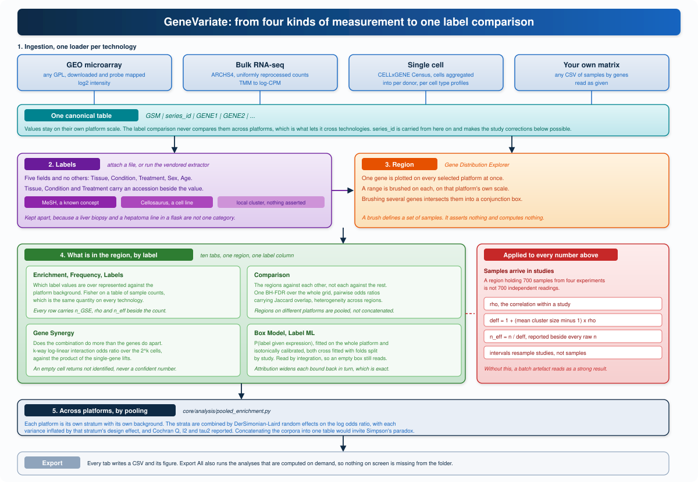

# Architecture and data flow

GeneVariate answers one question repeatedly: given a range of a gene's
expression, which sample labels live in that range. Everything in the program
exists to make that question askable on data that arrived from different
measurement technologies, and to make the answer honest about how the samples
were collected.

[](architecture.svg)

## 1. Ingestion

Four routes bring data in, and all four end in the same table.

| Route | Module | What it fetches |
|---|---|---|
| GEO platform | `core/gpl_downloader.py` | a GPL's samples, probe values mapped to gene symbols |
| Bulk RNA-seq | `sources/archs4.py`, `core/sources/archs4.py` | an ARCHS4 slice as uniformly reprocessed counts |
| Single cell | `sources/cellxgene.py`, `utils/pseudobulk.py` | a CELLxGENE Census query aggregated to per-donor per-cell-type profiles |
| Your own matrix | `core/db_loader.py` | a CSV or a compressed CSV read as is |

The canonical shape is

```text
GSM | series_id | GENE1 | GENE2 | ...
```

One row is one sample. `series_id` is the GEO study the sample came from, and
it is the column every later correction depends on, because samples arrive
from GEO in study-sized clumps rather than as independent draws. When a source
carries no study identifier the program says so rather than assuming
independence.

Probe-to-gene collapse takes the maximum probe per gene per sample. ARCHS4
counts are log-CPM transformed on load. Single-cell data is aggregated to
profiles before it ever reaches the analysis layer, so no analysis in the
program treats a cell as a sample.

`sources/discovery.py` searches GEOmetadb, ARCHS4, CELLxGENE and Expression
Atlas by keyword, so a platform can be found without leaving the program.

## 2. Labels

A label file is attached per platform. It is a CSV keyed on `GSM` with five
value columns and nothing else:

**Tissue, Condition, Treatment, Sex, Age.**

Tissue, Condition and Treatment additionally carry accession columns, because
the vendored extractor resolves them against controlled vocabularies. The
namespaces are kept apart by `core/label_entities.py`:

| Accession | Namespace | What it asserts |
|---|---|---|
| `D008099` | MeSH | the value named a concept the vocabulary knows |
| `CVCL_0027` | Cellosaurus | the value named a catalogued cell line, not a tissue |
| `ART-T-00042` | local | no vocabulary recognised it, so spellings are grouped and nothing more is claimed |

Reading all three as "the tissue" would merge a liver biopsy, a hepatoma line
grown in a flask and an unrecognised phrase into one category, and that is a
distinction no downstream analysis can recover once the accession is dropped.
The **Label Entities** window shows which values landed in which namespace.

Labels can be produced three ways: attach a file you already have, run the
vendored [LLM-GEO-Label-Extractor](https://github.com/SciSpectator/LLM-GEO-Label-Extractor)
through `core/geo_extract_driver.py`, or type them in by hand.

## 3. Region

`gui/app.py` draws the **Gene Distribution Explorer**, one panel per selected
platform. Dragging across a panel brushes a range. A brush is a set of samples
and nothing else, which is what makes the next step possible: the range is
defined on one platform's own scale, so no cross-technology unit conversion is
ever performed.

Regions may be brushed on several genes at once. A multi-gene brush is a box in
expression space, and the samples inside it are the conjunction.

## 4. Comparison

`gui/region_analysis.py` opens on **Analyze Selected Range** with ten tabs,
each consuming the same region and the same label column.

| Tab | Backed by |
|---|---|
| Distributions | matplotlib panels per platform |
| Labels | value proportions inside the region |
| Frequency | the raw counts under the proportions |
| Enrichment | `core/analysis/enrichment.py` with `core/analysis/overdispersion.py` |
| Gene Synergy | `core/analysis/synergy.py` |
| Box Model | `core/analysis/box_model.py` |
| Comparison | `core/analysis/region_comparison.py` and `core/analysis/pooled_enrichment.py` |
| Label ML | `core/analysis/label_ml.py` |
| Statistics | per-platform numeric summary |
| Samples | the sample rows themselves |

`gui/compare_analysis.py` and the **Cross-Platform Analysis** window compare
whole platforms rather than one region, and apply the same study-clumping
correction to every test they run.

## 5. Honesty layer

`core/analysis/overdispersion.py` sits underneath every count and every test
in the program. It estimates how much of a quantity's spread is between studies
rather than between samples, converts that into Kish's design effect, and
reports an effective sample size beside the raw count. Confidence intervals
resample studies, not samples. The derivations are in [methods.md](methods.md).

Where a platform has no `series_id`, the design effect is 1 and the interface
states that the p-values assume every sample is an independent experiment. It
does not silently pretend the correction was applied.

## 6. Export

`gui/exporting.py` wraps the `ttk.Treeview` constructor at startup, so every
table the program will ever draw gets a Save button, a right-click menu and
Ctrl+S without anyone having to remember to wire one. `export_window` writes
every table and every figure of a window at once, and the region window's
**Export All** additionally computes the tabs that are only drawn on demand so
that an export of a freshly opened window is not missing them. The file naming
is documented in [output-schema.md](output-schema.md).

## 7. The assistant

**Ctrl+/** opens `gui/windows/chat_sidebar.py`, driven by `core/chatbot/`.

| Module | Role |
|---|---|
| `registry.py` | the tool list, each tool a thin call into the same analysis API the buttons use |
| `agent.py`, `langchain_agent.py` | the reasoning loop |
| `router.py` | picks the backend |
| `code_exec.py` | runs analysis code the model writes, sandboxed to the loaded frames |
| `source_reader.py` | lets the model read this repository's own source when asked how something is computed |
| `learned.py` | saves a tool the model composed so it can be reused |
| `charts.py` | renders results into the assistant's own window rather than into the chat |

Tools include `load_geo_platform`, `list_platforms`, `search_experiments`,
`extract_labels`, `label_entities`, `gene_distribution`, `condition_enrichment`,
`variability_enrichment`, `meta_enrichment`, `region_comparison`,
`gene_synergy`, `region_box_model`, `classify_distributions`, `compare_gene`,
`compare_modalities`, `cross_modality_gene`, `gene_connections`,
`cluster_samples`, `label_markers`, `activity_inference`, `fetch_single_cell`,
`rank_genes`, `run_analysis_code`, `read_source` and `save_learned_tool`.

There are no hardcoded answers and no keyword rules deciding what an analysis
means. The model is given the computed numbers and asked to explain them. It is
never asked to produce them.

The backend is selected by environment variable:

```bash
GENEVARIATE_AGENT_BACKEND=ollama            # or groq, or openai-compatible
GENEVARIATE_AGENT_MODEL=<model name>
GENEVARIATE_LLM_URL=http://127.0.0.1:11434/v1
```

`core/llm_client.py` is a thin HTTP chat client. No model runs inside the
program, so a missing endpoint degrades the assistant and the extractor and
leaves every other feature working.

## Threading

Network fetches and long computations run on worker threads from
`utils/workers.py`. Results are handed back to Tk through an event queue, and
log lines through `app.enqueue_log`. No analysis touches a widget from a
worker thread.

## What is not here

The program holds no model weights, no API keys and no `.env` file. It reads
GEO, ARCHS4 and CELLxGENE over the network and sends nothing anywhere else. The
label extractor and the assistant talk to an OpenAI-compatible endpoint that
you point them at, and to nothing you did not point them at.
